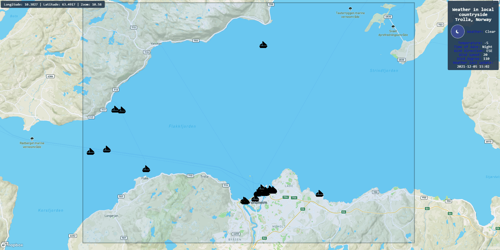

# Norwegian sea vessels tracker - frontend react

### Link to source code of backend this application: [https://github.com/byko-dev/vessels_tracking_api](https://github.com/byko-dev/vessels_tracking_api)

### I used:
- React.js
- Mapbox => [link](https://www.mapbox.com/)

`Developed by byko-dev 2021`
